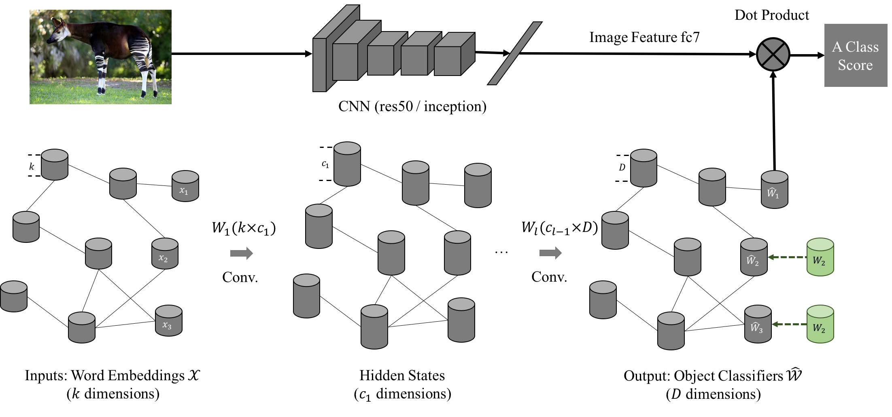
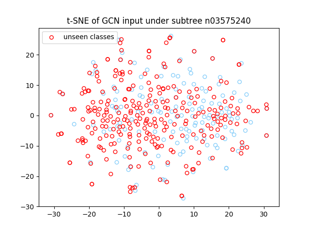
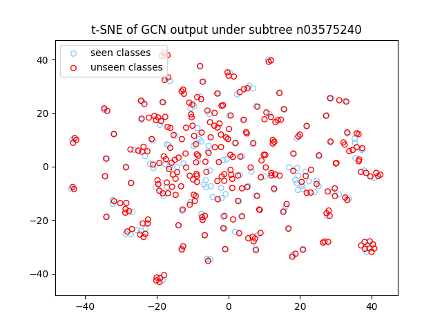
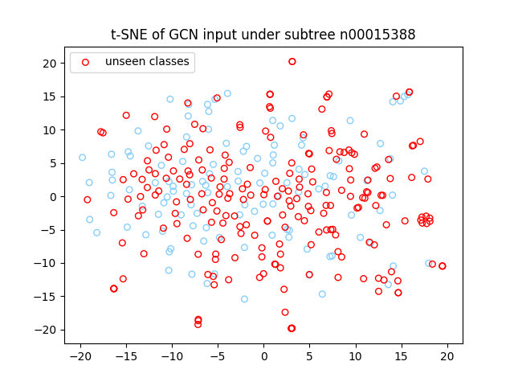
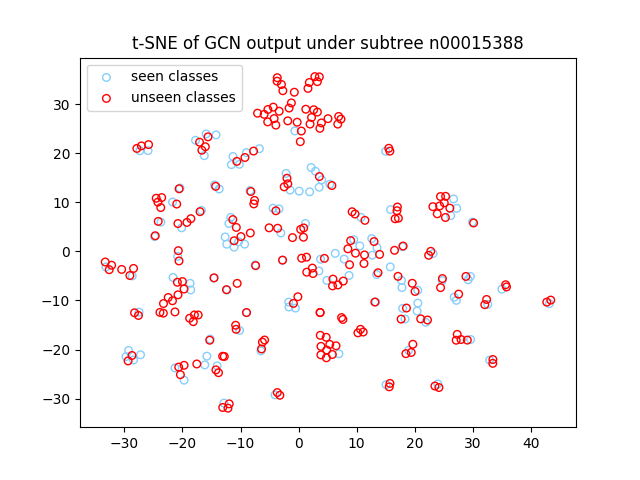

# Zero-shot GCN

This code is a re-implementation of the zero-shot classification in ImageNet in the paper [Zero-shot Recognition via Semantic Embeddings and Knowledge Graphs](https://arxiv.org/abs/1803.08035). The code is developed based on the [TensorFlow framework](https://www.tensorflow.org/) and the Graph Convolutional Network (GCN) [repo](https://github.com/tkipf/gcn/tree/master/gcn).

   

Our pipeline consists of two parts: CNN and GCN.
- **CNN**: **Input** an image and **output** deep features for the image.
- **GCN**: **Input** the word embedding for every object class, and **output** the visual classifier for every object class. Each visual classifier (1-D weight vector) can be applied on the deep features for classification.


<!---
The pipeline is as the figure above depicts. It consists of two network: CNN and the Graph Convolutional Networ (GCN) module. Our GCN model takes word embeddings for each object node as inputs and outputs the visual classifier for each object node. We take CNN as off-the-shelf network (ImageNet-1k pre-trained specifically) to extract image feature and provide its final FC classifiers as ground truths for the GCN outputs during training. After training with the visual classifiers of 1000 seen classes, we can generate the classifiers of all unseen classes. These classifiers can be directly on the extracted image features.
--->

## Citation
If you use our code in your research or wish to refer to the benchmark results, please use the following BibTeX entry.
```
@article{wang2018zero,
  title={Zero-shot Recognition via Semantic Embeddings and Knowledge Graphs},
  author={Wang, Xiaolong and Ye, Yufei and Gupta, Abhinav},
  journal={CVPR},
  year={2018}
}
```

## Using Our Code

```bash
git clone git@github.com:JudyYe/zero-shot-gcn.git
cd zero-shot-gcn/src
```
Without further specification, we default the root directory to `zero-shot-gcn/src`.


## Dataset Preparation
Please read [`DATASET.md`](DATASET.md) for downloading images and extracting image features.

## Testing Demo
With extracted feature and semantic embeddings, at this point, we can perform zero-shot classification with the [model](https://www.dropbox.com/sh/q9mid4wjj5vy0si/AADg8_NobfxkDot3VM7tE8Fua?dl=0) we provide.
```Shell
wget -O ../data/wordnet_resnet_glove_feat_2048_1024_512_300 https://www.dropbox.com/s/e7jg00nx0h2gbte/wordnet_resnet_glove_feat_2048_1024_512_300?dl=0
python test_imagenet.py --model ../data/wordnet_resnet_glove_feat_2048_1024_512_300
```
The above line defaults to `res50` + `2-hops` combination and test under two settings: unseen classes with or without seen classes. (see the paper for further explaination.)

We also provide other configurations. Please refer to the code for details.

## Main Results
We report the results with the above testing demo code (using ResNet-50 visual features and GloVe word embeddings). All experiments are conducted with the ImageNet dataset.

We first report the results on testing with only unseen classes. We compare our method with the state-of-the-art method [`SYNC`](https://arxiv.org/abs/1603.00550) in this benchmark.

<center>
   
ImageNet Subset |Method | top 1 | top 2 |top 5 |top 10| top 20 |
---|---|---|---|---|---|---|
2-hops | SYNC <br/> GCNZ (Ours) | 10.5 <br/> **21.0** |	17.7<br/>**33.7** | 28.6 <br/> **52.7** |	40.1<br/>  **64.8** |	52.0 <br/> **74.3**
3-hops | SYNC <br/>GCNZ (Ours) | 2.9 <br/> **4.3** | 	4.9<br/> **7.7** |9.2 <br/> **14.2**	| 14.2 <br/> **20.4** |	20.9 <br/> **27.6** |
All | SYNC <br/>GCNZ (Ours) | 1.4 <br/> **1.9**	|2.4 <br/> **3.4** |4.5 <br/> **6.4**	|7.1 <br/>  **9.3**	|10.9 <br/> **12.7** |

</center>

We then report the results under the generalized zero-shot setting, i.e. testing with both unseen and seen classes. We compare our method with the state-of-the-art method [`ConSE`](https://arxiv.org/abs/1312.5650) in this benchmark.

<center>
   
ImageNet Subset |Method | top 1 | top 2 |top 5 |top 10| top 20 |
---|---|---|---|---|---|---|
2-hops (+1K) | ConSE <br/> GCNZ (Ours) | 0.1 <br/> **10.2** |	11.2<br/> **21.2** | 24.3 <br/> **42.1** |	29.1<br/> **56.2** |	32.7 <br/> **67.5**
3-hops (+1K) | ConSE <br/>GCNZ (Ours) | 0.2 <br/> **2.4** | 	3.2<br/> **5.3** |7.3 <br/> **12.0**	| 10.0 <br/> **18.2** |12.2 <br/> **25.4** |
All (+1K) | ConSE <br/>GCNZ (Ours) | 0.1 <br/> **1.1**	|1.5 <br/> **2.4** |3.5 <br/> **5.4**	|4.9 <br/> **8.3**	|6.2 <br/> **11.7** |

</center>

We also visualize the t-SNE plots of GCN inputs and outputs for two subtrees of WordNet as followings.

synset word|t-SNE of input word embeddings | t-SNE of output visual classifiers
---|:-------------------------:|:-------------------------:
instrumentality<br/> instrumentation|      |  
animal,<br/> animate being,<br/> beast, brute, <br/>creature, fauna |  | 


## Training
As [`DATASET.md`](DATASET.md) illustrates, `convert_to_gcn_data.py` prepares data to train GCN. It supports two CNN network `fc` = `res50` or `inception`, and three semantic embedding `wv` = `glove` or `google` or `fasttext`.
The output will be saved to ../data/$wv_$fc/
```Shell
python convert_to_gcn_data.py --fc res50 --wv glove
```

After preparing the data, we can start training by using:
```Shell
python gcn/train_gcn.py --gpu $GPU_ID 	--dataset ../data/glove_res50/ --save_path $SAVE_PATH
```
